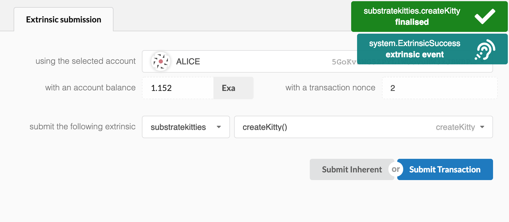

Viewing a Structure
===

Now that we have set up our runtime to make kitties, we should check our work!

We have introduced a custom structure to our chain, and while the Polkadot-JS Apps UI is very good at adapting to our changes, in this situation, we need to give it a hint on how to deserialize our structured data.

> REMINDER: Remember to reset your chain so that you start of fresh when interacting with the UI:
>
> ```
> ./build.sh
> cargo build --release
> ./target/release/substratekitties purge-chain --dev
> ./target/release/substratekitties --dev
> ```

## Registering a Custom Struct

Fortunately, the Polkadot-JS Apps UI provides us with a very simple way to import custom structures so that the page will be able to decode the information correctly.

In the **Settings** tab, under the **developer** section, there is an input field where you can submit a JSON file. Save this JSON object into a `.json` file and submit that file into the Polkadot-JS Apps UI.

```
{
    "Kitty": {
        "id": "H256",
        "dna": "H256",
        "price": "Balance",
        "gen": "u64"
    }
}
```

Finally press `Save & Reload`.

## Creating a Kitty

Now we can go and create a new kitty. In the **Extrinsics** tab, go to:

```
substratekitties > createKitty()
```

Once you press submit, you should see the transaction finalize:



## Viewing a Kitty

Finally, we can go into the **Chain State** tab, and view our stored kitty object. Select:

```
kittyStorage > ownedKitty(AccountId): Kitty
```

Then select a user who has called the `createKitty()` function. You should then be able to see the individual properties of the `Kitty` object:


---
**Learn More**

Talk about serialization and deserialization.

How we simply transfer and transmit raw bytes

[TODO: make this a page]

---
