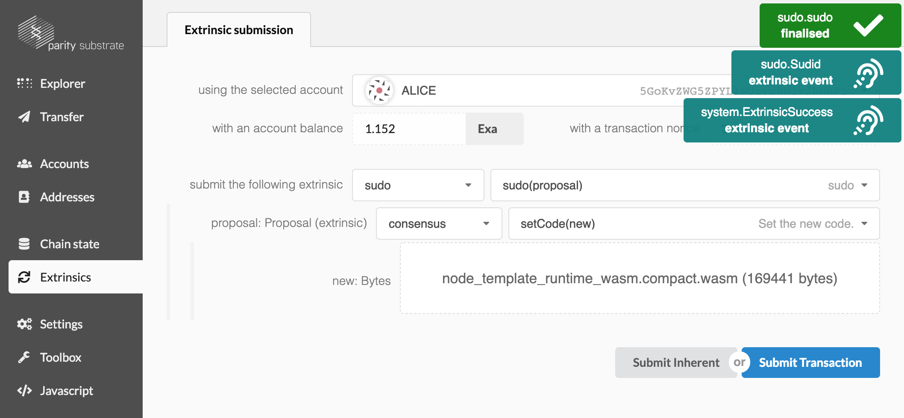

キティを交配する
===

おそらくオリジナルのCryptoKittiesゲームの最もユニークな部分は、既存のキティ同士の掛け合わせで新しいキティを生み出せることです。

これを私たちのゲームにも実装するために、既に`Kitty`オブジェクトには、新しいキティを産み出すのに使われる`dna`と `gen`を導入しています。

## 特徴を引き継ぐ

私たちのUIでは、キティのDNAを使ってキティ画像を生成します。DNAは256ビットのハッシュで設計されており、これは私たちのコードではバイト配列として、今後のUIでは16進数の文字列として表されます。

つまり、32個の要素があり、それぞれ0〜255の値になります。これらの要素を使用して、私たちのキティが持つ特性を決定します。例えば、バイト配列の最初のインデックスは、キティの256通りの色を決定する値です。他の要素は、目の形や毛の色などを表します：

```
Attribute:  Color Eyes Hair Collar Accessory
DNA:        [233] [15] [166] [113] [67] ...
```

2匹のキティを交配するとき、その子孫のDNAは親のDNAの組み合わせから生成されるべきです。そのためには、今回のゲームでは、インデックスごとに両親のどちらかをランダムで選び、選ばれた親のそのインデックスの値を子孫のDNAを構成する要素として引き継ぎます。

```
Kitty1 DNA:   [212] [163] [106] [250] [251] [  0] [ 75]...
                |     |                       |
Child DNA:    [212] [163] [ 69] [195] [223] [  0] [201]
                            |     |     |           |
Kitty2 DNA:   [233] [ 49] [ 69] [195] [223] [133] [201]...
```

テンプレートに既に遺伝子選択アルゴリズムを提供していますが、気軽に修正を加えて実験してみてください。

## チェーンアップグレード（オプション）

Substrateの優れた機能の1つは、既存のノードを壊すことなくブロックチェーンに新しい機能を追加し、フォークレスでリアルタイムのチェーンアップグレードが可能なことです。

ここでは、チェーンを削除後にネイティブのバイナリを再構築してアップグレードするのではなく、Wasmランタイムのみを使用してチェーンをアップグレードする方法を説明します。

まず、いつも通りターミナルでブロック生成を行っていることを確認してください。そして別のターミナルを開き、以下を実行：

```
./build.sh
```

これにより、次のパスに新しいコンパクトWasmバイナリが生成されます：

```
./runtime/wasm/target/wasm32-unknown-unknown/release/node_template_runtime_wasm.compact.wasm
```

Polkadot UIでこのファイルを使用してチェーンをアップグレードできます。 Polkadot UIの **Extrinsics** アプリに移動して、以下を選択します:

```
submit the following extrinsic: sudo > sudo(proposal)
    proposal: Proposal (extrinsic): consensus > setCode(new)
```


それから、この呼び出しへの入力として`compact.wasm`ファイルを使います。この`Sudo`関数は、ジェネシス設定で`admin`として設定されたアカウントでしか呼び出しができません。基本的には**Alice**を使ってコールを行ってください。

**Submit Transaction** を押してブロックが作成されると、ランタイムのアップグレードが成功したことを示す`Sudid`イベントが表示されるはずです。失敗する場合は、ノードに表示されるエラーメッセージを確認してください。



最後に、ページを更新してSubstratekittiesモジュールで利用可能なExtrinsicsを見ると、`breedKitty()`関数が表示されているはずです！


アップグレード前に保存された状態（キティ、残高など）がある場合は、ランタイムアップグレード後もこの状態が維持されていることがわかります。この時点で、あなたのブロックチェーンは、Substrateが提供するWasmインタプリタを通して、Wasmバージョンのランタイムを実行しています。このランタイムはブロックチェーン上で動作します。つまり、チェーンを実行しているすべてのノードと同期され、ネットワーク全体の同期も保たれます。インタプリタでWasmを処理するのはネイティブコードを処理するより遅いので、`cargo build --release`で新しい実行ファイルをビルドしてノードを再起動することでいつでもフルノードアップグレードを行うことができます。

## 演習してみよう！

第2章で`mint()`関数をリファクタリングしたことは、今回の`breed()`関数を実装する上で非常に役立つと気づくでしょう。２匹のキティをインプットとして、遺伝子選択アルゴリズムを使って新しいキティを生成してください。

子供の`gen`の値は、親キティの`gen`のどちらか大きい値に１を増加させてください。こうすることで、交配で産まれたキティと無から生まれたキティとを区別することができます。

次に、そのキティオブジェクトを `mint()`関数に渡して新しいキティを作成しましょう。

最後に、今回追加した機能が問題なく実装されているか確認するために、先ほど学んだフォークレスランタイムアップグレードをしてください。すると、既存のストレージアイテムは今回のアップグレードの影響を受けないこと、この新しい機能にアクセスできることを確認できます。

<!-- tabs:start -->

#### ** テンプレート **

[embedded-code](../../3/assets/3.4-template.rs ':include :type=code embed-template')

#### ** 解答 **

[embedded-code-final](../../3/assets/3.4-finished-code.rs ':include :type=code embed-final')

<!-- tabs:end -->
