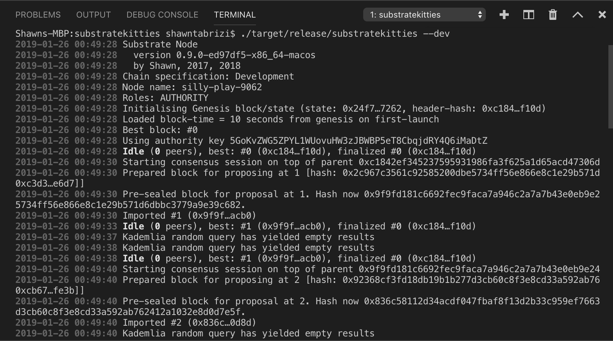

# 运行一个自定义节点

现在你已经在计算机上成功安装了 Substrate 框架，我们可以使用预先配置的模板快速启动自定义 Substrate 节点。

Substrate 是个快速发展的项目，这意味着可能会不时地引入 breaking changes 。为了改善本教程的开发体验，我们创建了一个稳定的，可工作的 Substrate 节点版本和兼容的 Substrate UI，你将在本教程中使用它们。

一旦你开始使用这个 Substrate 包，那么完成本教程的剩余部分对你来说应该没有问题，但若是出现问题请及时让我们知道。为获取该包，在你的工作目录运行以下命令：

```bash
git clone https://github.com/shawntabrizi/substrate-package
```

`substrate-package` 仓库包含两个文件夹：

1. `substrate-node-template`
2. `substrate-ui`

我们在本教程第 4 章前不会涉及到 `substrate-ui`，但从名字我们就能知道，该文件夹主要包含一份预构建的，由 [React](https://reactjs.org/) 编写的 UI，以后可以被自定义地扩展。

相反，我们将主要在 `substrate-node-template` 文件夹中工作，该文件夹包含一个最小的，可运行的 Substrate 节点，我们将开始修改它。

让我们使用 `substrate-package-rename.sh` 脚本重命名我们的项目和项目文件夹：

```bash
./substrate-package-rename.sh substratekitties <your_name>
```

接着让我们进入刚刚重命名的 `substratekitties` 文件夹并构建我们的预配置节点：

```bash
cd substratekitties
./init.sh
./build.sh
cargo build --release
```

这个过程可能会花费一段时间，但是一旦完成，你应该就能启动你的节点了：

```bash
./target/release/substratekitties --dev
```

如果你完成了这些，你应该能看到有块产生。



---
**Learn More**

`substrate-package` 仓库是由我们之前使用过的 `getsubstrate.io` 中的 [一些命令](https://github.com/paritytech/substrate-up) 制作的。

如果你要开始一个新项目并希望获得最新版本的 Substrate，你可以通过运行以下命令来构建自己的 Substrate 包：

```bash
substrate-node-new <project_name> <your_name>
substrate-ui-new <project_name>
```

就像之前说过的，该方法的一个缺点就是这些脚本直接从不同的 GitHub 仓库中提取，这意味着在有 breaking changes 时可能会出现不兼容的情况。

---
